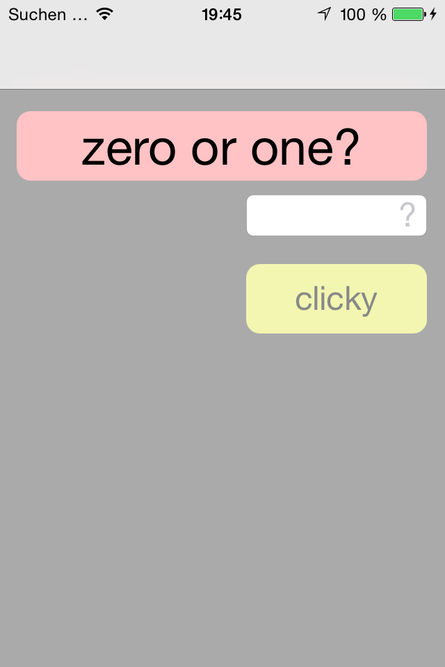
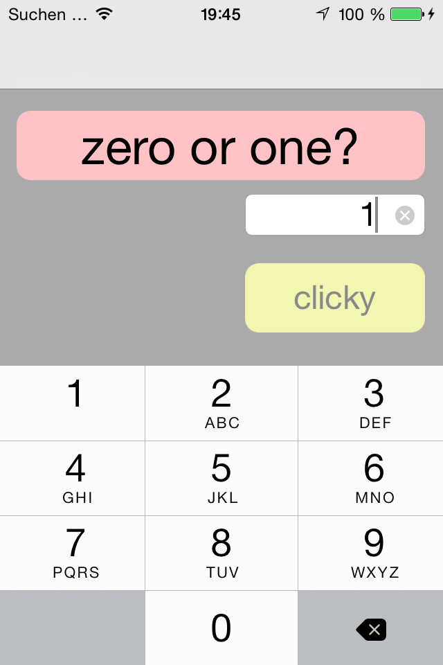
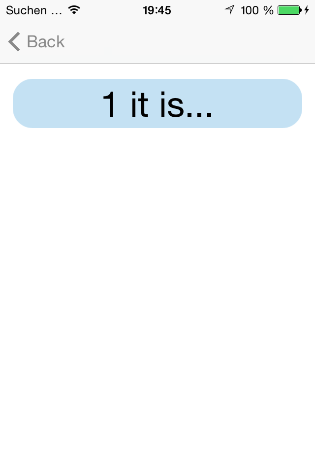
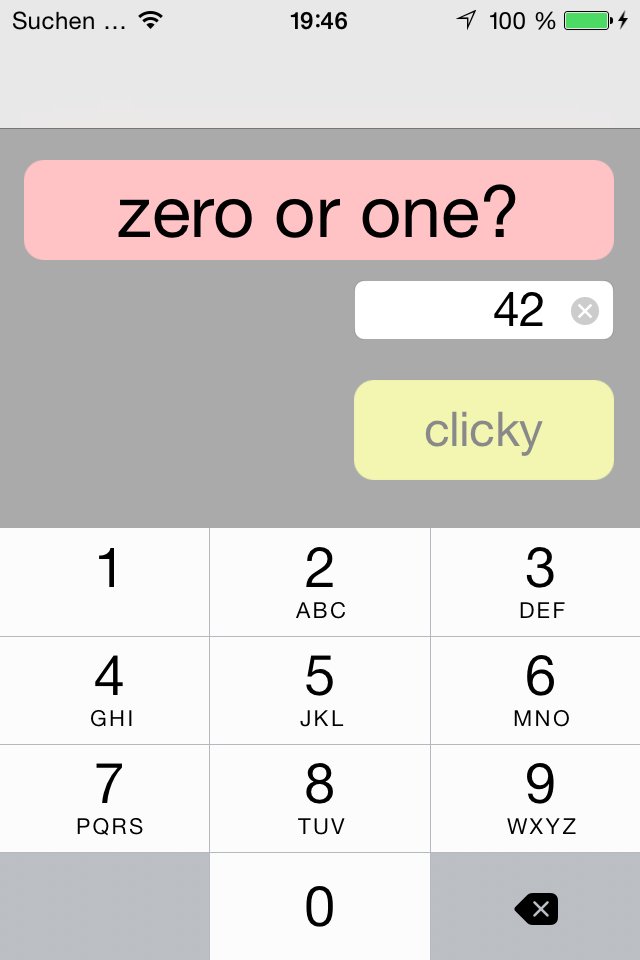
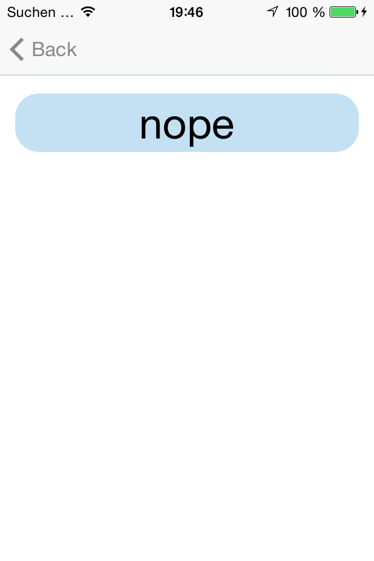
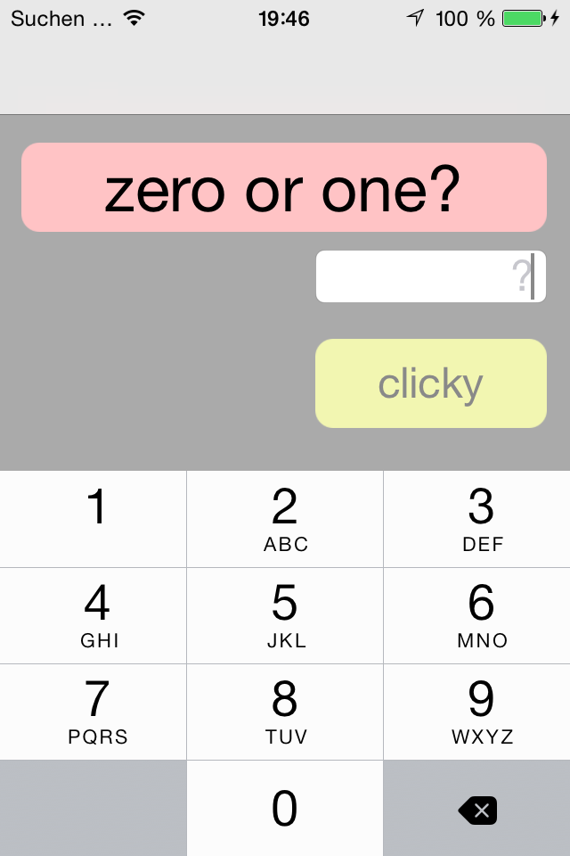
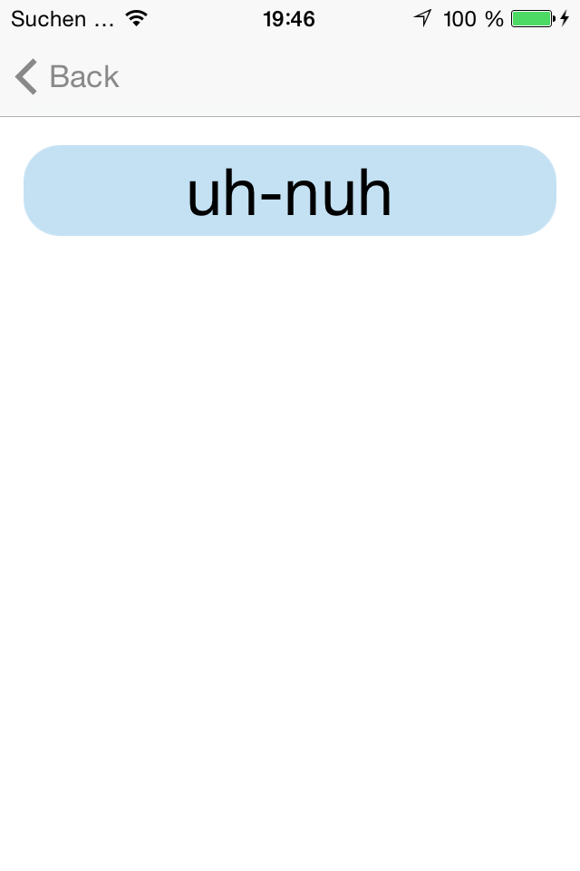
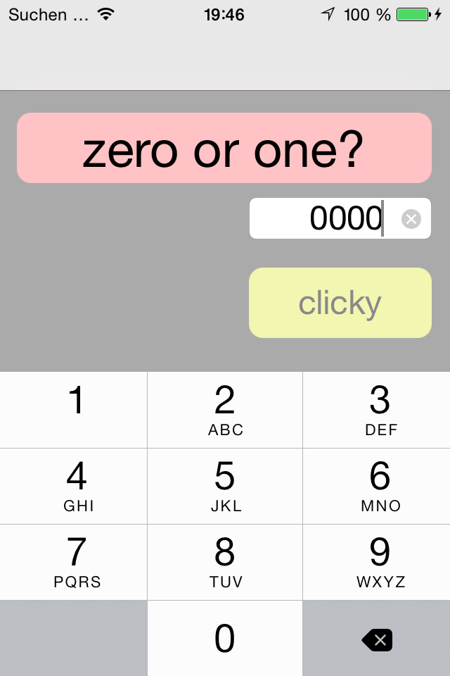
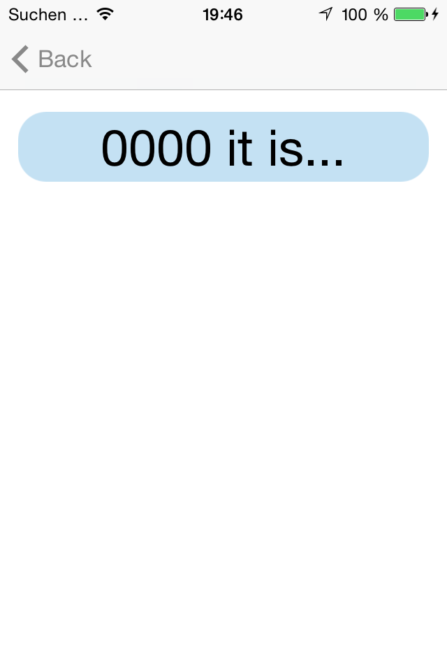

# secondscreen

A very basic iOS app consisting of only one label, one input field, one button and a second screen (where the output gets displayed)... waiting for you to choose between 0 and 1.

Extension of [simplefield](../simplefield/).

## Screenshots

  

